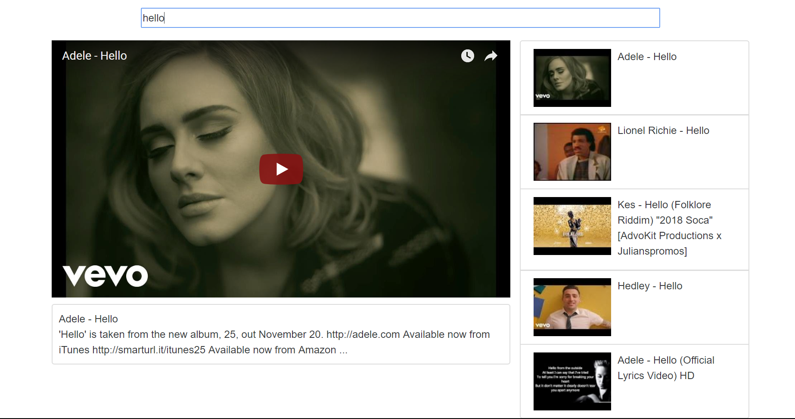

# Video-Player-Site
This is a React JS project that uses the YouTube API. The purpose of this was simply to strengthen my knowledge of React as well as JS in general. Please feel free to play around with it and let me know what you think.
## Getting Started
1. Clone the repo or download the ZIP file
2. Run `npm install`
3. Get a YouTube API Key and place it in the index.js file, assigning it `const API_KEY = 'YOUR API KEY'. Please note you must have the YouTube Data API enabled on your google account
4. Run `npm start`
5. Navigate to http://localhost:8080/

